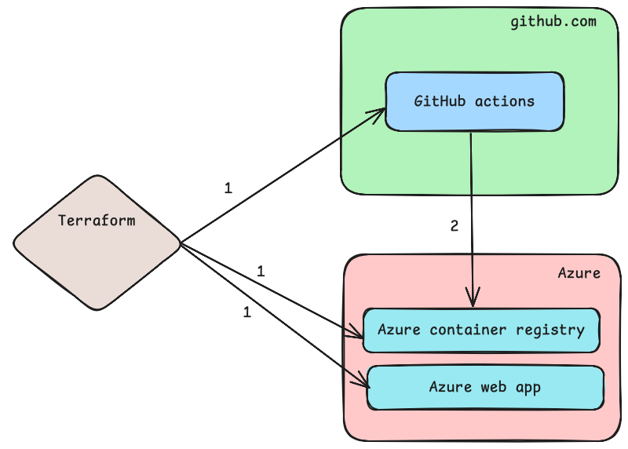

# A file management metadata API
A simple *File Management System* backend application using *python fast API*  deployed in *Azure apps* that allows users to upload, retrieve, and manage files. The project will integrate with *Azure service bus* for message processing and *Azure Blob* for file storage, along with *CosmosDB* for storing metadata about the uploaded files.

## Architecture
Terraform provisions the infra and github actions handles the CI.

From the architecture, the step `1` is a provisioning step which creates the infra and also update secrets to github actions.
The step `2` updates the container registry upon github actions run.

## Contribution
Thank you for your interest for contributing
### Setting up a local environment
Ensure `docker` and `make` is installed and working on the local environment
1. Build the package into a docker container with tag `fsmgmt`
```
make build
```
2. Launch the app inside the container at `http://localhost:8000`
```
make run
```

3. Run unit tests to check everything works
```
make test
``` 

4. Check logs
```
docker logs fsmgmt
```

## Deploy it to the production
The infrastructure is implemented with terraform and all the configs and scripts exists under `infra/` directory

### Prerequisites:
1. `terraform` installed and available on the path
2. `az` cli installed and ready to be logged in

### Setup the environment
1. Setup python `fsmgmt` venv environment
```
python -m venv fsmgmt
source fsmgmt/bin/activate
```
2. Setup subscription and credentials
a. Change directory to the correct directory
```
cd infra/
```
b. Store `.env.template` to `.env` and values to it.
```
cp .env.template .env
# Edit .env and fill-in values
```
c. Source those values with `source` command
```
source .env
```
d. Login to your Azure subscription with az cli to provide access to terraform
```
az login
```

### Perform the infra creation

1. Terraform initialize
```
terraform init
```
2. Terraform apply
```
terraform apply
```


## Plan
### Version 1:
1. Create bare python fast api app, says hello world for CRUD operations
2. Deploy in Azure apps
3. Implement blob storage and attach to app
4. Implement upload and listing
5. Implement cosmosDB and attach to app
6. Add metadata to cosmosDB
### Version 2:
1. Implement deletion
2. Add Azure service bus


a. Version 1: Python App available locally that can upload to blob
1. Run terraform from CLI from local computer
2. Terraform: Implement Azure blob storage with terraform
3. Terraform: Create a service principal
4. Terraform: Assign `storage blob officer` permissions to that service principal for the given storage account
5. Python: Implement python FAST API app to accept upload, list and download with dummy actions
6. Create client id and client secret for that service principal and set it to env vars
7. Python: Read client id and client secret and upload the data to blob
8. Python: List and download blob data

b. Version 2: Database updated with metadata
1. Define metadata: size, timestamp, filename and blob path
2. Terraform: Create CosmosDB with postgreSQL
3. Terraform: Assign `database admin`? permissions to service principal for that DB.
4. Python: Connect and upload metadata to DB everytime

c. Version 3: Python app to be deployed to Azure apps
1. 

d. Version 4: Add the Azure message bus
1. 